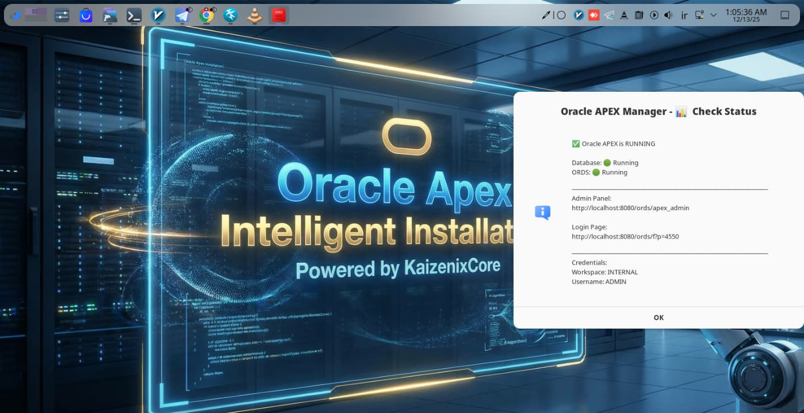
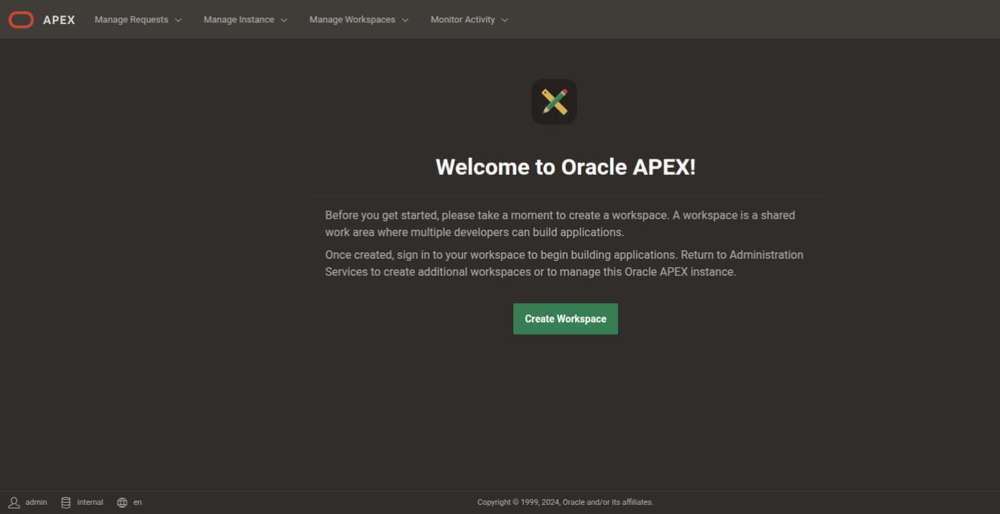

<div align="center">

<!-- ANIMATED HEADER -->


<br><br>

# 🚀 Oracle APEX Ultimate Installer

<h3>
  
  Automated • GUI Manager • Docker-Based • Systemd Integrated
  
</h3>

<p><i>KaizenixCore Edition v2.0.0</i></p>

<!-- BADGES -->
<p>
  
  
  
</p>

<p>
  
  
  
  
</p>

<br>

<!-- LANGUAGE NAVIGATION -->
<h3>🌍 Select Language</h3>

<table>
  <tr>
    <td align="center" style="padding: 20px;">
      <a href="#-english-documentation">
        <br><br>
        <b>🇬🇧 English</b>
      </a>
    </td>
    <td align="center" style="padding: 20px;">
      <a href="docs/README.fa.md">
        <br><br>
        <b>🇮🇷 فارسی</b>
      </a>
    </td>
    <td align="center" style="padding: 20px;">
      <a href="docs/README.de.md">
        <br><br>
        <b>🇩🇪 Deutsch</b>
      </a>
    </td>
  </tr>
</table>

</div>

<br>

---

<br>

<!-- ENGLISH DOCUMENTATION -->
<div id="-english-documentation"></div>

## 📖 About The Project


**Oracle APEX Ultimate Installer v2.0** is a state-of-the-art Bash script designed to fully automate the deployment of **Oracle APEX**, **ORDS**, and **Oracle Database XE 21c**.

Now featuring a **Native GUI Manager**, **Desktop Application integration**, and **Systemd Service auto-start**. Using Docker, it creates a pristine, isolated environment and automatically handles complex configurations like **Error 571** patches and **Proxy Authentication** — saving you hours of manual setup!

<br>

### 🎯 What Is This Installer?

This is an **intelligent automation solution** that transforms a complex, multi-hour Oracle APEX installation process into a simple, automated workflow. Think of it as your personal DevOps engineer that:

- **Understands Your System**: Automatically detects your Linux distribution and adapts accordingly
- **Handles Dependencies**: Installs Docker, Java, Zenity, and all required tools
- **Deploys Everything**: Sets up Oracle Database XE 21c, APEX, and ORDS in perfect harmony
- **Native GUI Manager**: Provides a modern, multi-language graphical interface for management
- **System Integration**: Creates Desktop Shortcuts and Systemd services for auto-start on boot

<br>

### 🔧 What Does It Do?

<div align="center">

| Phase | What Happens | Why It Matters |
|:---:|:---|:---|
| **🔍 Pre-Flight** | System validation and compatibility checks | Ensures your system can run Oracle APEX |
| **📦 Dependencies** | Installs Docker, Java, Zenity, curl, wget | Prepares your environment automatically |
| **🐳 Containerization** | Creates isolated Docker environment | Clean setup, no conflicts with existing software |
| **🗄️ Database Setup** | Deploys Oracle Database XE 21c | Production-grade database in minutes |
| **🌐 APEX Installation** | Installs Oracle Application Express | Low-code development platform ready |
| **⚡ ORDS Configuration** | Sets up Oracle REST Data Services | Web interface and REST APIs enabled |
| **🖥️ GUI & Integration** | Creates Desktop App & Systemd Services | Native application experience |
| **🔧 Auto-Fixing** | Applies security patches and fixes | Prevents common installation errors |

</div>

<br>

### 💡 Why Choose This Installer?

<table>
<tr>
<td width="50%" valign="top">

#### ❌ Traditional Manual Installation

- Takes **2-4 hours** of technical work
- Requires **deep Oracle knowledge**
- Complex **dependency management**
- Prone to **configuration errors**
- **No GUI** or management tools
- **Manual service configuration** required
- Risk of **system conflicts**
- No **automated fixes** included

</td>
<td width="50%" valign="top">

#### ✅ Oracle APEX Ultimate Installer v2

- Completes in **10-15 minutes** automatically
- **Native GUI Manager** included
- **Desktop Shortcut** (Like a real app)
- **Auto-Start** on boot (Systemd)
- **Auto-fixes** common errors (571, 404)
- **Built-in diagnostics** and repair tools
- **Isolated Docker** environment
- **Complete management suite** included

</td>
</tr>
</table>

<br>

### 🚀 Installation Workflow

The installer follows a smart, battle-tested process in **7 phases**:

<br>

**PHASE 1: SYSTEM PREPARATION**
- Detect Linux distribution (Ubuntu/Debian/Fedora/openSUSE/etc)
- Check system resources (RAM, disk space, CPU)
- Verify internet connectivity

**PHASE 2: DEPENDENCY INSTALLATION**
- Install Docker Engine & Compose
- Install Java (OpenJDK 17)
- Install **Zenity** (For GUI)
- Configure Docker permissions

**PHASE 3: DOCKER ENVIRONMENT**
- Pull Oracle Database XE 21c image
- Create Docker network & Persistent volumes
- Configure port mappings (1521, 8080)

**PHASE 4: DATABASE DEPLOYMENT**
- Start Oracle Database container
- Wait for database initialization
- Create database users and schemas

**PHASE 5: APEX & ORDS INSTALLATION**
- Download & Extract APEX/ORDS (Latest)
- Install APEX schemas & Configure REST
- Configure connection pools & Proxy Authentication
- Apply **Error 571 Fix** automatically

**PHASE 6: POST-INSTALLATION**
- Create management scripts
- Generate **Native GUI Manager** (`launch-gui.sh`)
- Create **Systemd Services** (`oracle-apex-db` & `oracle-apex-ords`)
- Generate **Desktop Entry** (`.desktop` file)

**PHASE 7: VERIFICATION**
- Run system health checks
- Generate installation report
- Display access credentials and URLs

<br>

### 🎁 What You Get

After installation completes, you'll have:

<div align="center">

| Component | Description | Access |
|:---:|:---|:---|
| **🗄️ Oracle Database XE 21c** | Enterprise-grade database | Port 1521 |
| **🌐 Oracle APEX** | Low-code development platform | Web interface |
| **⚡ Oracle ORDS** | REST Data Services | Port 8080 |
| **🖥️ GUI Manager** | Native graphical management tool | Desktop Menu |
| **🚀 Auto-Start Services** | Systemd integration | Boot time |
| **🛠️ Management Scripts** | Start, stop, status, fix, logs | Scripts folder |

</div>

<br>

## ✨ Key Features

<div align="center">
<table>
  <tr>
    <td align="center" width="25%">
      <br><br>
      <b>🖥️ Native GUI</b><br>
      <sub>Modern Zenity Interface</sub>
    </td>
    <td align="center" width="25%">
      <br><br>
      <b>🔧 Auto Fixes</b><br>
      <sub>Patches Error 571 & 404</sub>
    </td>
    <td align="center" width="25%">
      <br><br>
      <b>🔒 Secure</b><br>
      <sub>Strict Password Policies</sub>
    </td>
    <td align="center" width="25%">
      <br><br>
      <b>🚀 Auto-Start</b><br>
      <sub>Systemd Service Integrated</sub>
    </td>
  </tr>
  <tr>
    <td align="center" width="25%">
      <br><br>
      <b>🐳 Docker Isolated</b><br>
      <sub>Clean & Safe Environment</sub>
    </td>
    <td align="center" width="25%">
      <br><br>
      <b>📚 Multi-Language</b><br>
      <sub>EN, FA, DE (GUI supported)</sub>
    </td>
    <td align="center" width="25%">
      <br><br>
      <b>🛠️ Helper Tools</b><br>
      <sub>Reset PW, Fix Proxy, Logs</sub>
    </td>
    <td align="center" width="25%">
      <br><br>
      <b>📱 Desktop App</b><br>
      <sub>App Menu Integration</sub>
    </td>
  </tr>
</table>
</div>

<br>

## 📋 Access Information

<div align="center">

Once the installation is complete, use these credentials:

| Service | URL / Details |
| :--- | :--- |
| 🔐 **Admin Panel** | `http://localhost:8080/ords/apex_admin` |
| 🏠 **Landing Page** | `http://localhost:8080/ords/_/landing` |
| 👤 **Login Page** | `http://localhost:8080/ords/f?p=4550` |
| 🏢 **Workspace** | `INTERNAL` |
| 👤 **Username** | `ADMIN` |
| 🔑 **Password** | *(Set during installation)* |

</div>

<br>

## 🛠️ Management Scripts

<div align="center">

Helper scripts are located in `~/oracle-apex-complete/scripts/`:

| Script | Command | Description |
| :---: | :--- | :--- |
| 🖥️ **GUI Manager** | `bash scripts/launch-gui.sh` | **Recommended:** Opens graphical menu |
| 🟢 **Start** | `bash scripts/start.sh` | Starts Database and ORDS services |
| 🔴 **Stop** | `bash scripts/stop.sh` | Stops all containers and services |
| 📊 **Status** | `bash scripts/status.sh` | Checks health of DB and ORDS |
| 🔧 **Fix Proxy** | `bash scripts/fix-proxy.sh` | Fixes Error 571 / Proxy issues |
| 🔑 **Reset PW** | `bash scripts/reset-apex-password.sh` | Resets APEX Admin password |
| 📜 **Logs** | `bash scripts/logs.sh` | View real-time logs |

</div>

<br>

## 📸 Screenshots

<div align="center">

### 🖥️ Native GUI Manager

| Main Menu | Status Check |
| :---: | :---: |
|  |  |

<br>

### 🌐 Web Interface

| Landing Page | APEX Dashboard |
| :---: | :---: |
|  |  |

</div>

<br>

## 📝 System Requirements

<div align="center">

| Requirement | Minimum | Recommended |
| :--- | :---: | :---: |
| **🖥️ Operating System** | Linux (Any Distro) | Ubuntu 22.04 / openSUSE |
| **🐳 Docker** | v20.10+ | v24.0+ |
| **☕ Java** | OpenJDK 11 | OpenJDK 17+ |
| **🎨 GUI Lib** | Zenity | Latest |
| **💾 RAM** | 4 GB | 8 GB+ |
| **💿 Disk Space** | 20 GB | 50 GB+ |
| **🌐 Network** | Internet Required | Stable Connection |

</div>

<br>
## ㅤ

___🚀 Quick Installation___
```
curl -fsSL https://raw.githubusercontent.com/KaizenixCore/oracle-apex-installer/main/oracle-apex-installer.sh -o install.sh && chmod +x install.sh && bash install.sh

```
***
<br>
## 📄 License

This project is licensed under the **MIT License** - see the [LICENSE](LICENSE) file for details.

<br>

---

<div align="center">

<br>


## Support & Contribute

<p>
  <i>If this project saved you time, consider supporting its development!</i>
</p>

<br>

<a href="https://daramet.com/KaizenixCore">
  
</a>
&nbsp;&nbsp;
<a href="https://daramet.com/KaizenixCore">
  
</a>
&nbsp;&nbsp;
<a href="https://github.com/KaizenixCore/oracle-apex-installer/stargazers">
  
</a>

<br><br>

<table>
  <tr>
    <td align="center" width="33%">
      <br>
      <b>Financial Support</b><br>
      <sub><a href="https://daramet.com/KaizenixCore">Donate via Daramet</a></sub>
    </td>
    <td align="center" width="33%">
      <br>
      <b>Spread the Word</b><br>
      <sub>Share with your network</sub>
    </td>
    <td align="center" width="33%">
      <br>
      <b>Contribute Code</b><br>
      <sub><a href="https://github.com/KaizenixCore/oracle-apex-installer/pulls">Submit a PR</a></sub>
    </td>
  </tr>
</table>

<br>

---

<br>


### Crafted with ❤️ by

# [Peyman Rasouli](https://github.com/peymanrasouli)

<sub>Full-Stack Developer & Open Source Enthusiast</sub>

<br>

<a href="https://github.com/peymanrasouli">
  
</a>
&nbsp;
<a href="https://github.com/peymanrasouli/oracle-apex-installer/issues">
  
</a>
&nbsp;
<a href="https://github.com/peymanrasouli/oracle-apex-installer/discussions">
  
</a>
&nbsp;
<a href="https://daramet.com/KaizenixCore">
  
</a>

<br><br>


<sub>
  © 2025 <b>KaizenixCore</b> • Released under the <b>MIT License</b>
  <br><br>
  
  If you found this useful, please give it a star!
  
</sub>

</div>
