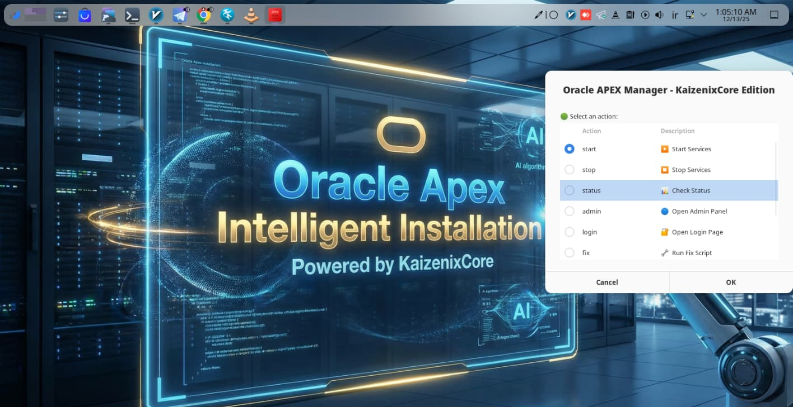
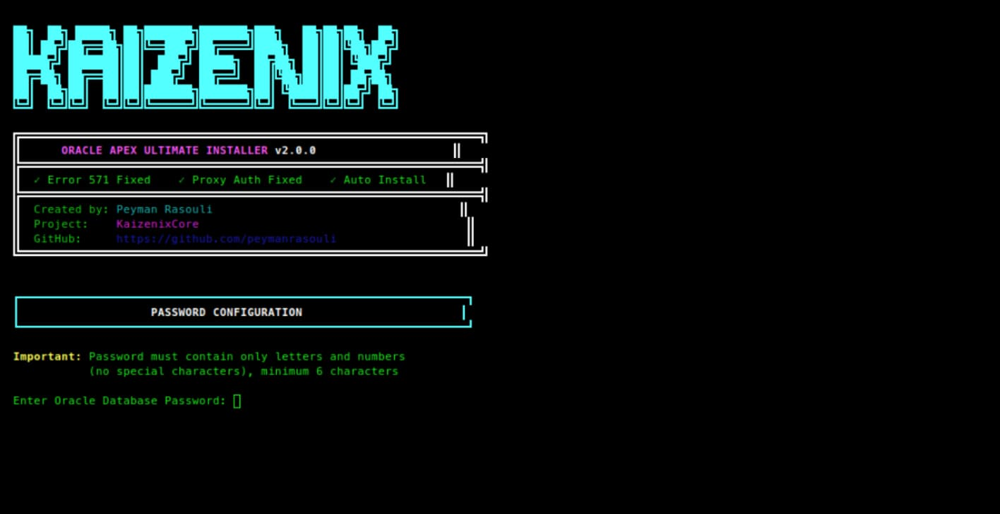
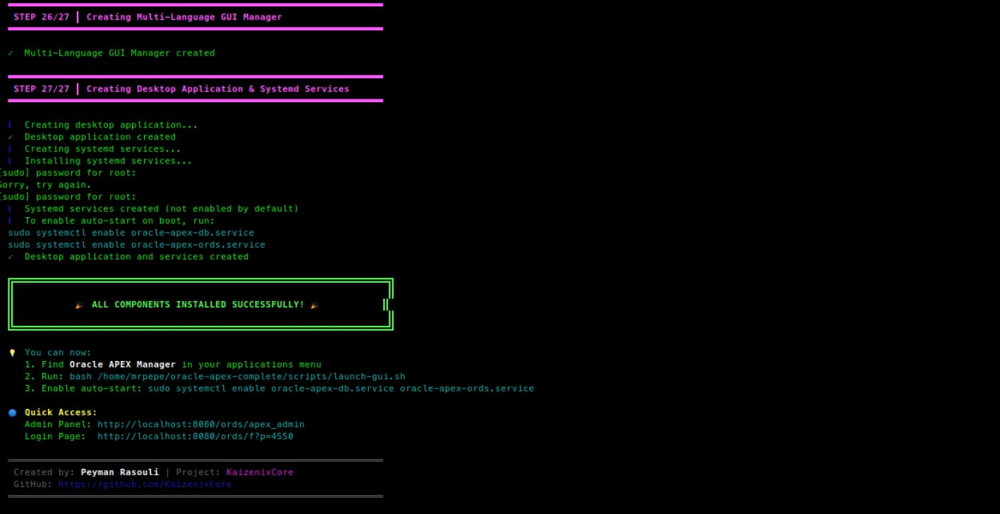

<div align="center">

<!-- ANIMATED HEADER -->


<br><br>

# 🚀 Der ultimative Oracle APEX Installer

<h3>
  
  Automatisiert • Grafische Verwaltung • Docker-basiert • Systemd-integriert
  
</h3>

<p><i>KaizenixCore Edition v2.4.0</i></p>

<!-- BADGES -->
<p>
  
  
  
</p>

<p>
  
  
  
  
</p>

<br>

<!-- NEW IN v2.4.0 BANNER -->
<table>
<tr>
<td>

### 🎉 Neu in Version 2.4.0

 **GUI-Absturz behoben** - Schließt nicht mehr unerwartet!<br>
 **Intelligente Auto-Wiederherstellung** - Schemas überleben Systemneustart<br>
 **Fehler 500/574 behoben** - Datenbank-Anmeldungsprobleme gelöst<br>
 **Invalid Schema behoben** - Kein "Schema nicht gefunden" mehr nach Neustart

</td>
</tr>
</table>

<br>

<!-- LANGUAGE NAVIGATION -->
<h3>🌍 Sprache auswählen</h3>

<table>
  <tr>
    <td align="center" style="padding: 20px;">
      <a href="../README.md#-english-documentation">
        <br><br>
        <b>🇬🇧 English</b>
      </a>
    </td>
    <td align="center" style="padding: 20px;">
      <a href="README.fa.md">
        <br><br>
        <b>🇮🇷 فارسی</b>
      </a>
    </td>
    <td align="center" style="padding: 20px;">
      <a href="#-deutsche-dokumentation">
        <br><br>
        <b>🇩🇪 Deutsch</b>
      </a>
    </td>
  </tr>
</table>

</div>

<br>

---

<br>

<!-- GERMAN DOCUMENTATION -->
<div id="-deutsche-dokumentation"></div>

## 📖 Über das Projekt


**Der ultimative Oracle APEX Installer v2.4.0** ist ein fortschrittliches Bash-Skript, das für die vollautomatische Installation von **Oracle APEX**, **ORDS** und **Oracle Database XE 21c** entwickelt wurde.

Diese Version enthält **native grafische Verwaltung**, **Desktop-Anwendungsintegration**, **automatischen Start mit Systemd** und **intelligente automatische Wiederherstellung**, die Ihre Schemas nach einem Systemneustart erhält. Mit Docker wird eine isolierte und saubere Umgebung erstellt und komplexe Konfigurationen wie **Fehler 571**, **Fehler 574**, **Fehler 500** und **Proxy-Authentifizierung** werden automatisch verwaltet — das spart Ihnen stundenlange manuelle Arbeit!

<br>

### 🆕 Änderungen in Version 2.4.0

<div align="center">

| Kategorie | Änderung | Beschreibung |
|:---:|:---|:---|
| 🐛 **Bugfix** | GUI-Absturz behoben | GUI schließt sich nach Aktionen nicht mehr |
| 🐛 **Bugfix** | Fehler 500 behoben | Internal Server Error gelöst |
| 🐛 **Bugfix** | Fehler 574 behoben | Database Credential Error gelöst |
| 🐛 **Bugfix** | Fehler 571 behoben | Proxy Authentication Error gelöst |
| 🐛 **Bugfix** | Invalid Schema behoben | "Schema nicht gefunden" nach Browser-Refresh gelöst |
| ✨ **Neue Funktion** | Intelligente Auto-Wiederherstellung | Stellt Proxy-Grants nach Neustart automatisch wieder her |
| ✨ **Neue Funktion** | Lock-File-System | Verhindert mehrfache GUI-Instanzen |
| ✨ **Neue Funktion** | Verbessertes Fix-Skript | Umfassende Behebung aller bekannten Probleme |
| 🔧 **Verbesserung** | Systemd-Dienste | Auto-Wiederherstellung in Boot-Dienste integriert |
| 🔧 **Verbesserung** | Start-Skript | Enthält jetzt automatische Schema-Wiederherstellung |
| 🔧 **Verbesserung** | GUI-Stabilität | Hauptmenü-Schleife hält GUI aktiv |
| 📚 **Dokumentation** | Vollständige Sprachunterstützung | Komplette EN/FA/DE-Übersetzungen in GUI |

</div>

<br>

### 🎯 Was ist dieser Installer?

Dies ist eine **intelligente Automatisierungslösung**, die den komplexen, mehrstündigen Oracle APEX-Installationsprozess in einen einfachen, automatisierten Workflow verwandelt. Betrachten Sie ihn als Ihren persönlichen DevOps-Ingenieur, der:

- **Ihr System versteht**: Erkennt automatisch Ihre Linux-Distribution und passt sich entsprechend an
- **Abhängigkeiten verwaltet**: Installiert Docker, Java, Zenity und alle erforderlichen Tools
- **Alles bereitstellt**: Richtet Oracle Database XE 21c, APEX und ORDS in perfekter Harmonie ein
- **Native grafische Verwaltung**: Bietet eine moderne, mehrsprachige grafische Oberfläche für die Verwaltung
- **Systemintegration**: Erstellt Desktop-Verknüpfungen und Systemd-Dienste für automatischen Start
- **Intelligente Wiederherstellung**: Behebt automatisch Schema- und Proxy-Probleme nach Systemneustart *(Neu in v2.4.0)*

<br>

### 🔧 Was macht dieser Installer?

<div align="center">

| Phase | Was passiert | Warum es wichtig ist |
|:---:|:---|:---|
| **🔍 Vorabprüfung** | Systemvalidierung und Kompatibilitätsprüfung | Stellt sicher, dass Ihr System Oracle APEX ausführen kann |
| **📦 Abhängigkeiten** | Installation von Docker, Java, Zenity, curl, wget | Automatische Vorbereitung Ihrer Umgebung |
| **🐳 Containerisierung** | Erstellung einer isolierten Docker-Umgebung | Saubere Installation, keine Konflikte mit vorhandener Software |
| **🗄️ Datenbank-Setup** | Bereitstellung von Oracle Database XE 21c | Enterprise-Datenbank in Minuten |
| **🌐 APEX-Installation** | Installation von Oracle Application Express | Low-Code-Entwicklungsplattform bereit |
| **⚡ ORDS-Konfiguration** | Einrichtung von Oracle REST Data Services | Web-Oberfläche und REST-API aktiviert |
| **🖥️ GUI & Integration** | Erstellung von Desktop-App & Systemd-Diensten | Native Anwendungserfahrung |
| **🔧 Auto-Reparatur** | Anwendung von Sicherheitspatches und Fixes | Verhindert häufige Installationsfehler |
| **🔄 Auto-Wiederherstellung** | Wiederherstellung der Schemas nach Neustart *(Neu)* | Kein "Invalid Schema"-Fehler mehr |

</div>

<br>

### 💡 Warum diesen Installer wählen?

<table>
<tr>
<td width="50%" valign="top">

#### ❌ Traditionelle manuelle Installation

- Dauert **2-4 Stunden** technische Arbeit
- Erfordert **tiefes Oracle-Wissen**
- Komplexe **Abhängigkeitsverwaltung**
- Anfällig für **Konfigurationsfehler**
- **Keine GUI** oder Verwaltungstools
- **Manuelle Dienstkonfiguration** erforderlich
- Risiko von **Systemkonflikten**
- **Keine automatischen Fixes** enthalten
- **Funktioniert nach Systemneustart nicht mehr**

</td>
<td width="50%" valign="top">

#### ✅ Ultimativer Oracle APEX Installer v2.4

- Wird automatisch in **10-15 Minuten** fertig
- **Native grafische Verwaltung** enthalten (Absturzfrei!)
- **Desktop-Verknüpfung** (Wie eine echte App)
- **Auto-Start** beim Booten (Systemd)
- **Auto-Reparatur** häufiger Fehler (500, 571, 574, 404)
- **Eingebaute Diagnose**- und Reparaturtools
- **Isolierte Docker**-Umgebung
- **Komplettes Verwaltungspaket** enthalten
- **Überlebt Systemneustart** mit intelligenter Wiederherstellung

</td>
</tr>
</table>

<br>

### 🚀 Installations-Workflow

Der Installer folgt einem intelligenten, bewährten Prozess in **8 Phasen**:

<br>

**PHASE 1: SYSTEMVORBEREITUNG**
- Erkennung der Linux-Distribution (Ubuntu/Debian/Fedora/openSUSE/usw.)
- Prüfung der Systemressourcen (RAM, Festplattenspeicher, CPU)
- Überprüfung der Internetverbindung

**PHASE 2: ABHÄNGIGKEITSINSTALLATION**
- Installation von Docker Engine & Compose
- Installation von Java (OpenJDK 17)
- Installation von **Zenity** (Für GUI)
- Konfiguration der Docker-Berechtigungen

**PHASE 3: DOCKER-UMGEBUNG**
- Abrufen des Oracle Database XE 21c-Images
- Erstellung von Docker-Netzwerk & persistenten Volumes
- Konfiguration der Port-Mappings (1521, 8080)

**PHASE 4: DATENBANK-BEREITSTELLUNG**
- Start des Oracle Database-Containers
- Warten auf Datenbankinitialisierung
- Erstellung von Datenbankbenutzern und Schemas

**PHASE 5: APEX & ORDS-INSTALLATION**
- Download & Extraktion von APEX/ORDS (Neueste Version)
- Installation von APEX-Schemas & REST-Konfiguration
- Konfiguration von Connection-Pools & Proxy-Authentifizierung
- Automatische Anwendung der **Fehler 571/574-Behebung**

**PHASE 6: NACH DER INSTALLATION**
- Erstellung von Verwaltungsskripten
- Generierung der **nativen grafischen Verwaltung** (`launch-gui.sh`)
- Erstellung von **Systemd-Diensten** (`oracle-apex-db` & `oracle-apex-ords`)
- Generierung der **Desktop-Entry-Datei** (`.desktop`)

**PHASE 7: VERIFIZIERUNG**
- Ausführung von System-Gesundheitsprüfungen
- Generierung des Installationsberichts
- Anzeige von Zugangsdaten und URLs

**PHASE 8: EINRICHTUNG DER INTELLIGENTEN WIEDERHERSTELLUNG** *(Neu in v2.4.0)*
- Konfiguration der Auto-Wiederherstellungsskripte
- Einrichtung der Proxy-Grant-Wiederherstellung
- Überprüfung der Neustart-Persistenz

<br>

### 🎁 Was Sie erhalten

Nach Abschluss der Installation haben Sie:

<div align="center">

| Komponente | Beschreibung | Zugriff |
|:---:|:---|:---|
| **🗄️ Oracle Database XE 21c** | Enterprise-Datenbank | Port 1521 |
| **🌐 Oracle APEX** | Low-Code-Entwicklungsplattform | Web-Oberfläche |
| **⚡ Oracle ORDS** | REST Data Services | Port 8080 |
| **🖥️ Grafische Verwaltung** | Natives grafisches Verwaltungstool (Stabil!) | Desktop-Menü |
| **🚀 Auto-Start-Dienste** | Systemd-Integration mit Wiederherstellung | Boot-Zeit |
| **🛠️ Verwaltungsskripte** | Start, Stopp, Status, Fix, Logs | Scripts-Ordner |
| **🔄 Auto-Wiederherstellung** | Überlebt Neustart ohne Fehler *(Neu)* | Automatisch |

</div>

<br>

## ✨ Hauptfunktionen

<div align="center">
<table>
  <tr>
    <td align="center" width="25%">
      <br><br>
      <b>🖥️ Native GUI</b><br>
      <sub>Moderne Zenity-Oberfläche</sub><br>
      <sub><i>✨ Absturzfrei in v2.4!</i></sub>
    </td>
    <td align="center" width="25%">
      <br><br>
      <b>🔧 Auto-Reparatur</b><br>
      <sub>Behebt Fehler 500, 571, 574, 404</sub><br>
      <sub><i>✨ Verbessert in v2.4!</i></sub>
    </td>
    <td align="center" width="25%">
      <br><br>
      <b>🔒 Sicher</b><br>
      <sub>Strenge Passwortrichtlinien</sub>
    </td>
    <td align="center" width="25%">
      <br><br>
      <b>🚀 Auto-Start</b><br>
      <sub>Systemd-Dienst integriert</sub>
    </td>
  </tr>
  <tr>
    <td align="center" width="25%">
      <br><br>
      <b>🐳 Docker-isoliert</b><br>
      <sub>Saubere & sichere Umgebung</sub>
    </td>
    <td align="center" width="25%">
      <br><br>
      <b>📚 Mehrsprachig</b><br>
      <sub>EN, FA, DE (Volle Unterstützung)</sub>
    </td>
    <td align="center" width="25%">
      <br><br>
      <b>🛠️ Hilfstools</b><br>
      <sub>PW zurücksetzen, Proxy-Fix, Logs</sub>
    </td>
    <td align="center" width="25%">
      <br><br>
      <b>🔄 Intelligente Wiederherstellung</b><br>
      <sub>Überlebt Neustart</sub><br>
      <sub><i>✨ Neu in v2.4!</i></sub>
    </td>
  </tr>
</table>
</div>

<br>

## 🐛 Behobene Probleme in v2.4.0

<div align="center">

| Fehler | Symptome | Lösung in v2.4.0 |
|:---:|:---|:---|
| **Fehler 500** | Internal Server Error auf APEX-Seiten | ORDS_METADATA-Schema-Installation behoben |
| **Fehler 574** | Database Credential Error | pool.xml-Konfiguration & Passwort-Sync behoben |
| **Fehler 571** | Proxy Authentication Required | Auto-Grant von Proxy-Berechtigungen beim Start |
| **Fehler 404** | Invalid Schema Name | Intelligente Wiederherstellung stellt Schemas nach Neustart wieder her |
| **GUI-Absturz** | Anwendung schließt sich nach Aktion | main_menu()-Schleife mit korrekter Handhabung implementiert |
| **Mehrere Fenster** | Mehrere GUI-Instanzen öffnen sich | Lock-File-System mit PID-Prüfung hinzugefügt |
| **Schema verloren** | "Invalid schema" nach Neustart | Auto-Wiederherstellung in Start-Skript & Systemd-Dienst |

</div>

<br>

## 📋 Zugangsinformationen

<div align="center">

Nach Abschluss der Installation verwenden Sie diese Zugangsdaten:

| Dienst | URL / Details |
| :--- | :--- |
| 🔐 **Admin-Panel** | `http://localhost:8080/ords/apex_admin` |
| 🏠 **Startseite** | `http://localhost:8080/ords/_/landing` |
| 👤 **Anmeldeseite** | `http://localhost:8080/ords/f?p=4550` |
| 🏢 **Workspace** | `INTERNAL` |
| 👤 **Benutzername** | `ADMIN` |
| 🔑 **Passwort** | *(Wird während der Installation festgelegt)* |

</div>

<br>

## 🛠️ Verwaltungsskripte

<div align="center">

Hilfsskripte befinden sich in `~/oracle-apex-complete/scripts/`:

| Skript | Befehl | Beschreibung |
| :---: | :--- | :--- |
| 🖥️ **Grafische Verwaltung** | `bash scripts/launch-gui.sh` | **Empfohlen:** Öffnet grafisches Menü *(Stabil!)* |
| 🟢 **Start** | `bash scripts/start.sh` | Startet mit **Auto-Wiederherstellung** *(Verbessert!)* |
| 🔴 **Stopp** | `bash scripts/stop.sh` | Stoppt alle Container und Dienste |
| 📊 **Status** | `bash scripts/status.sh` | Prüft Gesundheit von DB und ORDS |
| 🔧 **Problembehebung** | `bash scripts/fix.sh` | **Umfassende Behebung** aller Fehler *(Neu!)* |
| 🔧 **Proxy-Fix** | `bash scripts/fix-proxy.sh` | Behebt Fehler 571 / Proxy-Probleme |
| 🔑 **PW zurücksetzen** | `bash scripts/reset-apex-password.sh` | Setzt APEX-Admin-Passwort zurück |
| 📜 **Logs** | `bash scripts/logs.sh` | Zeigt Live-Logs an |

</div>

<br>

## 📸 Screenshots

<div align="center">

### 🖥️ Neu: Native grafische Verwaltung (v2.4.0 - Stabil!)
<p><i>Verwalten Sie Ihre APEX-Instanz mit einer modernen, absturzfreien grafischen Oberfläche</i></p>

| Hauptmenü-Dashboard | Status & Fortschritt |
| :---: | :---: |
|  |  |

<br>

### 💻 Klassische Terminal-Oberfläche
<p><i>Der leistungsstarke CLI-Installer, den Sie kennen und lieben</i></p>

| Installer-Start (Banner) | Installationserfolg |
| :---: | :---: |
|  |  |

<br>

### 🌐 Web-Oberfläche
<p><i>Ihre vollständig bereitgestellte Oracle APEX-Umgebung</i></p>

| Startseite | APEX-Dashboard |
| :---: | :---: |
|  |  |

</div>

<br>

## 📝 Systemanforderungen

<div align="center">

| Anforderung | Minimum | Empfohlen |
| :--- | :---: | :---: |
| **🖥️ Betriebssystem** | Linux (Jede Distribution) | Ubuntu 22.04 / openSUSE |
| **🐳 Docker** | v20.10+ | v24.0+ |
| **☕ Java** | OpenJDK 11 | OpenJDK 17+ |
| **🎨 GUI-Bibliothek** | Zenity | Neueste Version |
| **💾 RAM** | 4 GB | 8 GB+ |
| **💿 Festplattenspeicher** | 20 GB | 50 GB+ |
| **🌐 Netzwerk** | Internet erforderlich | Stabile Verbindung |

</div>

<br>

## 🚨 Fehlerbehebung

<div align="center">

| Problem | Lösung |
|:---|:---|
| **Fehler 500 nach Installation** | Ausführen: `bash scripts/fix.sh` |
| **Fehler 574 Database Credential** | Ausführen: `bash scripts/fix.sh` |
| **Invalid Schema nach Neustart** | Ausführen: `bash scripts/start.sh` (enthält Auto-Wiederherstellung) |
| **GUI schließt sich unerwartet** | Auf v2.4.0 aktualisieren - dieses Problem ist behoben! |
| **Mehrere GUI-Fenster öffnen sich** | Alle schließen und ausführen: `bash scripts/launch-gui.sh` |
| **APEX nicht erreichbar** | Status prüfen mit: `bash scripts/status.sh` |

</div>

<br>
<br>

## ㅤ

___🚀 Schnellinstallation___
```
curl -fsSL https://raw.githubusercontent.com/KaizenixCore/oracle-apex-installer/main/oracle-apex-installer.sh -o install.sh && chmod +x install.sh && bash install.sh

```

## 📄 Lizenz

Dieses Projekt ist unter der **MIT-Lizenz** lizenziert - siehe die [LICENSE](../LICENSE)-Datei für Details.

<br>

---

<div align="center">

<br>


## Unterstützung & Mitwirken

<p>
  <i>Wenn dieses Projekt Ihnen Zeit gespart hat, erwägen Sie, seine Entwicklung zu unterstützen!</i>
</p>

<br>

<a href="https://daramet.com/KaizenixCore">
  
</a>
&nbsp;&nbsp;
<a href="https://daramet.com/KaizenixCore">
  
</a>
&nbsp;&nbsp;
<a href="https://github.com/KaizenixCore/oracle-apex-installer/stargazers">
  
</a>

<br><br>

<table>
  <tr>
    <td align="center" width="33%">
      <br>
      <b>Finanzielle Unterstützung</b><br>
      <sub><a href="https://daramet.com/KaizenixCore">Spenden über Daramet</a></sub>
    </td>
    <td align="center" width="33%">
      <br>
      <b>Weitersagen</b><br>
      <sub>Mit Ihrem Netzwerk teilen</sub>
    </td>
    <td align="center" width="33%">
      <br>
      <b>Code beitragen</b><br>
      <sub><a href="https://github.com/KaizenixCore/oracle-apex-installer/pulls">PR einreichen</a></sub>
    </td>
  </tr>
</table>

<br>

---

<br>


### Mit ❤️ erstellt von

# [Peyman Rasouli](https://github.com/KaizenixCore/oracle-apex-installer/)

<sub>Full-Stack-Entwickler & Open-Source-Enthusiast</sub>

<br>

<a href="https://github.com/KaizenixCore/oracle-apex-installer/">
  
</a>
&nbsp;
<a href="https://github.com/KaizenixCore/oracle-apex-installer/issues">
  
</a>
&nbsp;
<a href="https://github.com/KaizenixCore/oracle-apex-installer/discussions">
  
</a>
&nbsp;
<a href="https://daramet.com/KaizenixCore">
  
</a>

<br><br>


<sub>
  © 2025 <b>KaizenixCore</b> • Veröffentlicht unter der <b>MIT-Lizenz</b>
  <br><br>
  
  Wenn Sie dies nützlich fanden, geben Sie bitte einen Stern!
  
</sub>

</div>
