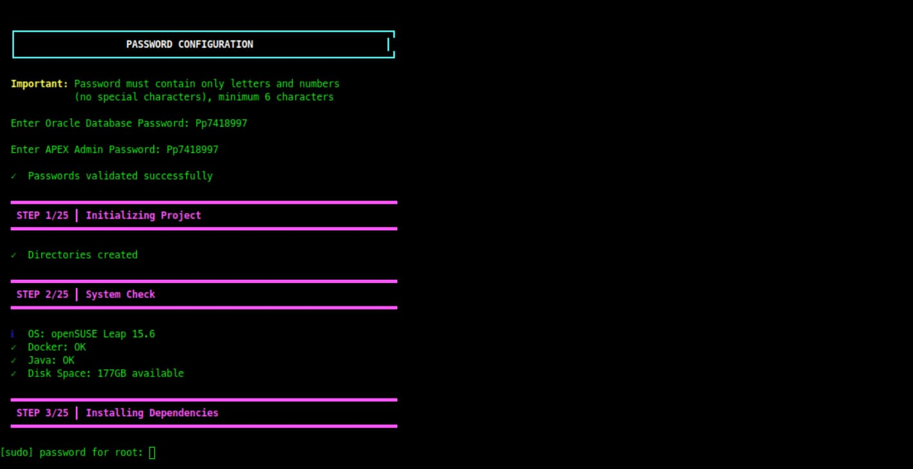

<div align="center" dir="rtl">

<!-- ANIMATED HEADER -->


<br><br>

# 🚀 نصاب حرفه‌ای Oracle APEX

<h3>
  
  خودکار • امن • مبتنی بر داکر • آماده تولید
  
</h3>

<p><i>نسخه KaizenixCore v1.0.0</i></p>

<!-- BADGES -->
<p>
  
  
  
</p>

<p>
  
  
  
  
</p>

<br>

<!-- LANGUAGE NAVIGATION -->
<h3>🌍 انتخاب زبان</h3>

<table>
  <tr>
    <td align="center" style="padding: 20px;">
      <a href="../README.md">
        <br><br>
        <b>🇬🇧 English</b>
      </a>
    </td>
    <td align="center" style="padding: 20px;">
      <a href="#-مستندات-فارسی">
        <br><br>
        <b>🇮🇷 فارسی</b>
      </a>
    </td>
    <td align="center" style="padding: 20px;">
      <a href="README.de.md">
        <br><br>
        <b>🇩🇪 Deutsch</b>
      </a>
    </td>
  </tr>
</table>

</div>

<br>

---

<br>

<!-- PERSIAN DOCUMENTATION -->
<div id="-مستندات-فارسی" dir="rtl">

## 📖 درباره پروژه


**نصاب حرفه‌ای Oracle APEX** یک اسکریپت Bash پیشرفته است که به طور کامل نصب **Oracle APEX**، **ORDS** و **Oracle Database XE 21c** را خودکار می‌کند.

با استفاده از Docker، یک محیط ایزوله و تمیز ایجاد می‌کند و به طور خودکار پیکربندی‌های پیچیده مانند رفع **خطای 571** و **احراز هویت پروکسی** را مدیریت می‌کند — ساعت‌ها وقت شما را صرفه‌جویی می‌کند!

<br>

### 🎯 این نصاب چیست؟

این یک **راهکار هوشمند اتوماسیون** است که فرآیند پیچیده و چند ساعته نصب Oracle APEX را به یک گردش کار ساده و خودکار تبدیل می‌کند. آن را به عنوان مهندس DevOps شخصی خود در نظر بگیرید که:

- **سیستم شما را می‌شناسد**: به طور خودکار توزیع لینوکس شما را تشخیص داده و خود را تطبیق می‌دهد
- **وابستگی‌ها را مدیریت می‌کند**: Docker، Java و تمام ابزارهای مورد نیاز را نصب و پیکربندی می‌کند
- **همه چیز را مستقر می‌کند**: Oracle Database XE 21c، APEX و ORDS را به طور هماهنگ راه‌اندازی می‌کند
- **مشکلات رایج را رفع می‌کند**: به طور خودکار خطاهای شناخته شده (571، 404، احراز هویت پروکسی) را وصله می‌کند
- **ابزارهای مدیریتی ارائه می‌دهد**: اسکریپت‌های کمکی برای عملیات روزانه آسان ایجاد می‌کند

<br>

### 🔧 چه کاری انجام می‌دهد؟

<div align="center">

| فاز | چه اتفاقی می‌افتد | چرا مهم است |
|:---:|:---|:---|
| **🔍 بررسی اولیه** | اعتبارسنجی سیستم و بررسی سازگاری | اطمینان از توانایی سیستم برای اجرای Oracle APEX |
| **📦 وابستگی‌ها** | نصب Docker، Java، curl، wget، unzip | آماده‌سازی خودکار محیط |
| **🐳 کانتینرسازی** | ایجاد محیط ایزوله Docker | نصب تمیز، بدون تداخل با نرم‌افزارهای موجود |
| **🗄️ راه‌اندازی دیتابیس** | استقرار Oracle Database XE 21c | پایگاه داده سطح تولید در چند دقیقه |
| **🌐 نصب APEX** | نصب Oracle Application Express | پلتفرم توسعه Low-Code آماده |
| **⚡ پیکربندی ORDS** | راه‌اندازی Oracle REST Data Services | رابط وب و REST API فعال |
| **🔧 رفع خودکار** | اعمال وصله‌های امنیتی و رفع مشکلات | جلوگیری از خطاهای رایج نصب |
| **📊 تایید** | تست تمام اجزا و تولید گزارش | تایید عملکرد صحیح همه چیز |

</div>

<br>

### 💡 چرا این نصاب را انتخاب کنیم؟

<table dir="rtl">
<tr>
<td width="50%" valign="top">

#### ❌ نصب دستی سنتی

- **2 تا 4 ساعت** کار فنی می‌برد
- نیاز به **دانش عمیق Oracle** دارد
- **مدیریت وابستگی** پیچیده
- مستعد **خطاهای پیکربندی**
- **بدون رفع خودکار** مشکلات رایج
- نیاز به **عیب‌یابی دستی**
- خطر **تداخل سیستمی**
- **بدون ابزارهای مدیریتی**

</td>
<td width="50%" valign="top">

#### ✅ نصاب حرفه‌ای Oracle APEX

- در **10 تا 15 دقیقه** به طور خودکار تکمیل می‌شود
- **بدون نیاز به تجربه قبلی**
- **تمام وابستگی‌ها** به طور خودکار مدیریت می‌شوند
- **پیش‌پیکربندی شده** با بهترین روش‌ها
- **رفع خودکار** خطاهای رایج (571، 404)
- **ابزارهای تشخیص** و تعمیر داخلی
- محیط **ایزوله Docker**
- شامل **مجموعه کامل مدیریتی**

</td>
</tr>
</table>

<br>

### 🚀 گردش کار نصب

نصاب یک فرآیند هوشمند و آزمایش شده را در **7 فاز** دنبال می‌کند:

<br>

**فاز 1: آماده‌سازی سیستم**
- تشخیص توزیع لینوکس (Ubuntu/Debian/Fedora/openSUSE و غیره)
- بررسی منابع سیستم (RAM، فضای دیسک، CPU)
- تایید اتصال اینترنت
- اعتبارسنجی مجوزهای کاربر

**فاز 2: نصب وابستگی‌ها**
- نصب موتور Docker
- نصب Java (OpenJDK 17)
- نصب ابزارهای سیستمی (curl، wget، unzip)
- پیکربندی مجوزهای Docker

**فاز 3: محیط Docker**
- دریافت تصویر Oracle Database XE 21c
- ایجاد شبکه Docker
- راه‌اندازی حجم‌های دائمی
- پیکربندی نگاشت پورت‌ها (1521، 8080)

**فاز 4: استقرار دیتابیس**
- راه‌اندازی کانتینر Oracle Database
- انتظار برای مقداردهی اولیه دیتابیس
- ایجاد کاربران و اسکیماهای دیتابیس
- پیکربندی امنیت و مجوزها

**فاز 5: نصب APEX**
- دانلود Oracle APEX (آخرین نسخه)
- استخراج و آماده‌سازی فایل‌ها
- نصب اسکیماهای APEX در دیتابیس
- ایجاد فضای کاری INTERNAL
- راه‌اندازی کاربر ADMIN با رمز عبور امن

**فاز 6: پیکربندی ORDS**
- دانلود Oracle REST Data Services
- پیکربندی استخرهای اتصال
- فعال‌سازی REST API
- اعمال رفع خطای 571
- پیکربندی احراز هویت پروکسی
- راه‌اندازی ORDS روی پورت 8080

**فاز 7: پس از نصب**
- ایجاد اسکریپت‌های مدیریتی (start/stop/status/fix/logs)
- اجرای بررسی‌های سلامت سیستم
- تولید گزارش نصب
- نمایش اعتبارنامه‌های دسترسی و URLها

<br>

### 🎁 چه چیزی دریافت می‌کنید

پس از تکمیل نصب، شما خواهید داشت:

<div align="center">

| جزء | توضیحات | دسترسی |
|:---:|:---|:---|
| **🗄️ Oracle Database XE 21c** | پایگاه داده سطح سازمانی | پورت 1521 |
| **🌐 Oracle APEX** | پلتفرم توسعه Low-Code | رابط وب |
| **⚡ Oracle ORDS** | سرویس‌های داده REST | پورت 8080 |
| **🛠️ اسکریپت‌های مدیریتی** | شروع، توقف، وضعیت، رفع، لاگ‌ها | پوشه اسکریپت‌ها |
| **📊 داشبورد مدیریت** | مدیریت کامل APEX | رابط وب |
| **🔐 پیکربندی امن** | بهترین روش‌های اعمال شده | محافظت شده با رمز عبور |

</div>

<br>

## ✨ ویژگی‌های کلیدی

<div align="center">
<table>
  <tr>
    <td align="center" width="25%">
      <br><br>
      <b>🐳 ایزوله Docker</b><br>
      <sub>محیط تمیز و امن</sub>
    </td>
    <td align="center" width="25%">
      <br><br>
      <b>🔧 رفع خودکار</b><br>
      <sub>وصله خطاهای 571 و 404</sub>
    </td>
    <td align="center" width="25%">
      <br><br>
      <b>🔒 امن</b><br>
      <sub>سیاست‌های رمز عبور سخت‌گیرانه</sub>
    </td>
    <td align="center" width="25%">
      <br><br>
      <b>🐧 چند توزیعی</b><br>
      <sub>روی هر لینوکسی کار می‌کند</sub>
    </td>
  </tr>
  <tr>
    <td align="center" width="25%">
      <br><br>
      <b>⚡ فوق‌العاده سریع</b><br>
      <sub>راه‌اندازی در 10-15 دقیقه</sub>
    </td>
    <td align="center" width="25%">
      <br><br>
      <b>📚 چند زبانه</b><br>
      <sub>انگلیسی، فارسی، آلمانی</sub>
    </td>
    <td align="center" width="25%">
      <br><br>
      <b>🛠️ ابزارهای مدیریتی</b><br>
      <sub>اسکریپت‌های کمکی داخلی</sub>
    </td>
    <td align="center" width="25%">
      <br><br>
      <b>✅ آماده تولید</b><br>
      <sub>آزمایش شده و پایدار</sub>
    </td>
  </tr>
</table>
</div>

<br>

## 📋 اطلاعات دسترسی

<div align="center">

پس از تکمیل نصب، از این اعتبارنامه‌ها استفاده کنید:

| سرویس | URL / جزئیات |
| :--- | :--- |
| 🔐 **پنل مدیریت** | `http://localhost:8080/ords/apex_admin` |
| 🏠 **صفحه اصلی** | `http://localhost:8080/ords/_/landing` |
| 👤 **صفحه ورود** | `http://localhost:8080/ords/f?p=4550` |
| 🏢 **فضای کاری** | `INTERNAL` |
| 👤 **نام کاربری** | `ADMIN` |
| 🔑 **رمز عبور** | *(در حین نصب تنظیم می‌شود)* |

</div>

<br>

## 🛠️ اسکریپت‌های مدیریتی

<div align="center">

اسکریپت‌های کمکی در مسیر `~/oracle-apex-complete/scripts/` قرار دارند:

| اسکریپت | دستور | توضیحات |
| :---: | :--- | :--- |
| 🟢 **شروع** | `bash scripts/start.sh` | شروع سرویس‌های دیتابیس و ORDS |
| 🔴 **توقف** | `bash scripts/stop.sh` | توقف تمام کانتینرها و سرویس‌ها |
| 📊 **وضعیت** | `bash scripts/status.sh` | بررسی سلامت DB و ORDS |
| 🔧 **رفع مشکل** | `bash scripts/fix.sh` | اجرای ابزارهای جامع تعمیر |
| 📜 **لاگ‌ها** | `bash scripts/logs.sh` | مشاهده لاگ‌های زنده |

</div>

<br>

## 📸 تصاویر

<div align="center">

### 🖥️ فرآیند نصب

| مرحله 1: شروع نصب | مرحله 2: نصب اجزا | مرحله 3: نصب کامل شد |
| :---: | :---: | :---: |
|  |  |  |

<br>

### 🌐 رابط وب

| صفحه اصلی | داشبورد APEX |
| :---: | :---: |
|  |  |

</div>

<br>

## 📝 نیازمندی‌های سیستم

<div align="center">

| نیازمندی | حداقل | توصیه شده |
| :--- | :---: | :---: |
| **🖥️ سیستم عامل** | لینوکس (هر توزیعی) | Ubuntu 22.04 / openSUSE |
| **🐳 Docker** | نسخه 20.10+ | نسخه 24.0+ |
| **☕ Java** | OpenJDK 11 | OpenJDK 17+ |
| **💾 RAM** | 4 گیگابایت | 8 گیگابایت یا بیشتر |
| **💿 فضای دیسک** | 20 گیگابایت | 50 گیگابایت یا بیشتر |
| **🌐 شبکه** | اینترنت الزامی | اتصال پایدار |

</div>

<br>

## ㅤ

___🚀 نصب سریع___

```
curl -fsSL https://raw.githubusercontent.com/KaizenixCore/oracle-apex-installer/main/oracle-apex-installer.sh -o install.sh && chmod +x install.sh && bash install.sh

```
***
<br>

## 📄 مجوز

این پروژه تحت مجوز **MIT** منتشر شده است - برای جزئیات فایل [LICENSE](../LICENSE) را ببینید.

<br>

---

<div align="center">

<br>


## حمایت و مشارکت

<p>
  <i>اگر این پروژه برای شما وقت صرفه‌جویی کرد، از توسعه آن حمایت کنید!</i>
</p>

<br>

<a href="https://daramet.com/KaizenixCore">
  
</a>
&nbsp;&nbsp;
<a href="https://daramet.com/KaizenixCore">
  
</a>
&nbsp;&nbsp;
<a href="https://github.com/KaizenixCore/oracle-apex-installer/stargazers">
  
</a>

<br><br>

<table dir="rtl">
  <tr>
    <td align="center" width="33%">
      <br>
      <b>حمایت مالی</b><br>
      <sub><a href="https://daramet.com/KaizenixCore">از طریق درامت کمک کنید</a></sub>
    </td>
    <td align="center" width="33%">
      <br>
      <b>اشتراک‌گذاری</b><br>
      <sub>با شبکه خود به اشتراک بگذارید</sub>
    </td>
    <td align="center" width="33%">
      <br>
      <b>مشارکت در کد</b><br>
      <sub><a href="https://github.com/KaizenixCore/oracle-apex-installer/pulls">Pull Request ارسال کنید</a></sub>
    </td>
  </tr>
</table>

<br>

---

<br>


### ساخته شده با ❤️ توسط

# [پیمان رسولی](https://github.com/KaizenixCore)

<sub>توسعه‌دهنده Full-Stack و علاقه‌مند به متن‌باز</sub>

<br>

<a href="https://github.com/KaizenixCore">
  
</a>
&nbsp;
<a href="https://github.com/KaizenixCore/oracle-apex-installer/issues">
  
</a>
&nbsp;
<a href="https://github.com/KaizenixCore/oracle-apex-installer/discussions">
  
</a>
&nbsp;
<a href="https://daramet.com/KaizenixCore">
  
</a>

<br><br>


<sub>
  © 2024 <b>KaizenixCore</b> • منتشر شده تحت مجوز <b>MIT</b>
  <br><br>
  
  اگر این پروژه مفید بود، یک ستاره بدهید!
  
</sub>

</div>

</div>
