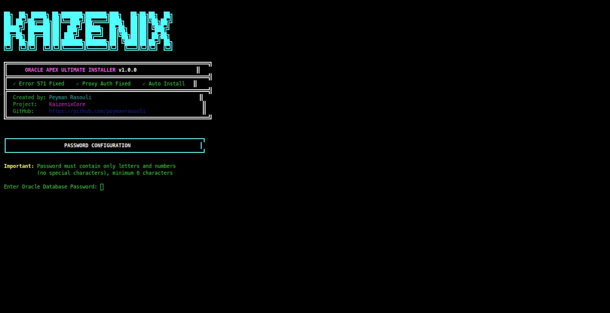
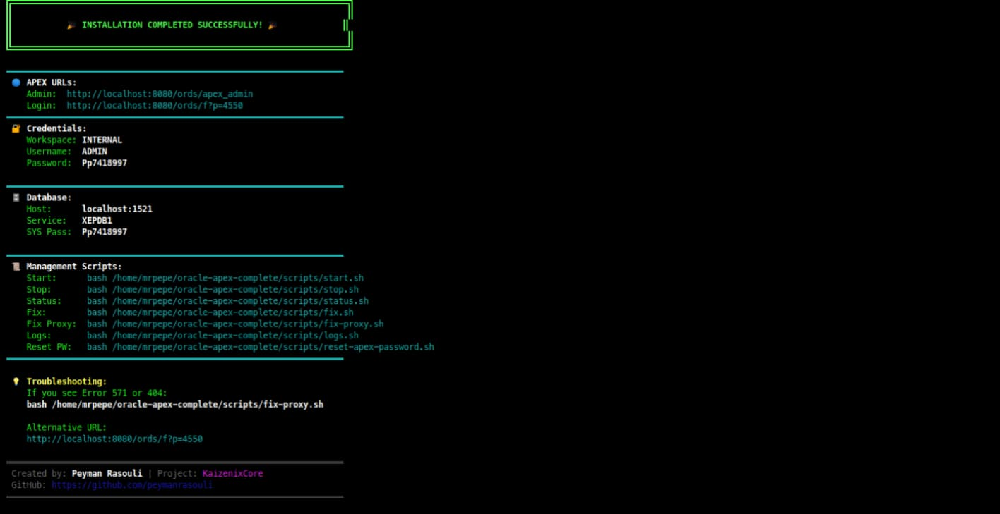
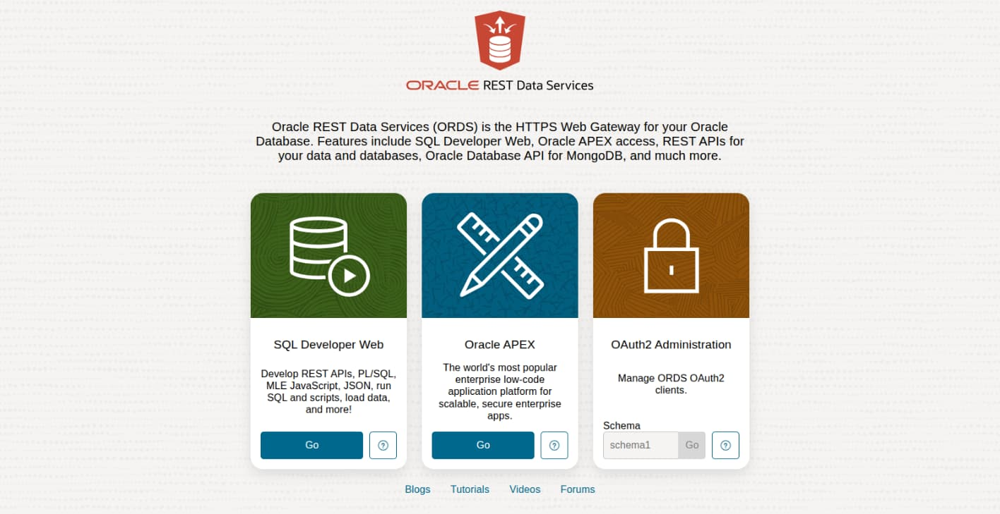

 

<!-- ANIMATED HEADER -->

  

# 🚀 نصاب کامل Oracle APEX

<h3>
  
  خودکار • امن • مبتنی بر داکر • آماده تولید
  
</h3>

<i>نسخه KaizenixCore v1.0.0</i>

<!-- BADGES -->

  
  
  

  
  
  
  

 

<!-- LANGUAGE NAVIGATION -->
<h3>🌍 انتخاب زبان</h3>

<table>
  <tr>
    <td align="center" style="padding: 20px;">
      <a href="../README.md">
          
        <b>🇬🇧 English</b>
      </a>
    </td>
    <td align="center" style="padding: 20px;">
      <a href="#-مستندات-فارسی">
          
        <b>🇮🇷 فارسی</b>
      </a>
    </td>
    <td align="center" style="padding: 20px;">
      <a href="README.de.md">
          
        <b>🇩🇪 Deutsch</b>
      </a>
    </td>
  </tr>
</table>

 

---

 

<!-- PERSIAN DOCUMENTATION -->

## 📖 درباره پروژه

**نصاب کامل Oracle APEX** یک اسکریپت Bash پیشرفته است که به طور کامل نصب و راه‌اندازی **Oracle APEX**، **ORDS** و **Oracle Database XE 21c** را خودکار می‌کند.

با استفاده از Docker، یک محیط ایزوله و تمیز ایجاد می‌کند و به طور خودکار پیکربندی‌های پیچیده مانند رفع **خطای 571** و **احراز هویت پروکسی** را انجام می‌دهد — ساعت‌ها از وقت شما را ذخیره می‌کند!

 

## ✨ ویژگی‌های کلیدی

<table>
  <tr>
    <td align="center" width="25%">
        
      <b>🐳 ایزوله با داکر</b> 
      محیط تمیز و امن
    </td>
    <td align="center" width="25%">
        
      <b>🔧 رفع خودکار</b> 
      رفع خطای 571 و 404
    </td>
    <td align="center" width="25%">
        
      <b>🔒 امنیت بالا</b> 
      سیاست‌های رمز عبور قوی
    </td>
    <td align="center" width="25%">
        
      <b>🐧 چند توزیعی</b> 
      روی هر لینوکسی کار می‌کند
    </td>
  </tr>
</table>

 

## 📋 اطلاعات دسترسی

پس از نصب، از این اطلاعات استفاده کنید:

| سرویس | آدرس / جزئیات |
| ---: | :--- |
| **پنل مدیریت** 🔐 | `http://localhost:8080/ords/apex_admin` |
| **صفحه اصلی** 🏠 | `http://localhost:8080/ords/_/landing` |
| **صفحه ورود** 👤 | `http://localhost:8080/ords/f?p=4550` |
| **فضای کاری** 🏢 | `INTERNAL` |
| **نام کاربری** 👤 | `ADMIN` |
| **رمز عبور** 🔑 | *(در حین نصب تنظیم می‌شود)* |

 

## 🛠️ اسکریپت‌های مدیریتی

اسکریپت‌های کمکی در مسیر `~/oracle-apex-complete/scripts/` قرار دارند:

| اسکریپت | دستور | توضیحات |
| :---: | :--- | ---: |
| **شروع** 🟢 | `bash scripts/start.sh` | راه‌اندازی دیتابیس و ORDS |
| **توقف** 🔴 | `bash scripts/stop.sh` | متوقف کردن تمام سرویس‌ها |
| **وضعیت** 📊 | `bash scripts/status.sh` | بررسی سلامت سیستم |
| **تعمیر** 🔧 | `bash scripts/fix.sh` | اجرای ابزارهای تعمیر |
| **لاگ‌ها** 📜 | `bash scripts/logs.sh` | مشاهده لاگ‌های زنده |

 

## 📸 تصاویر

### 🖥️ فرآیند نصب

| مرحله 1: شروع نصب | مرحله 2: نصب اجزا | مرحله 3: اتمام نصب |
| :---: | :---: | :---: |
|  |  |  |

 

### 🌐 رابط وب

| صفحه اصلی | داشبورد APEX |
| :---: | :---: |
|  |  |

 

## 📝 نیازمندی‌های سیستم

| نیازمندی | حداقل | توصیه شده |
| ---: | :---: | :---: |
| **سیستم عامل** 🖥️ | لینوکس (هر توزیعی) | Ubuntu 22.04 / openSUSE |
| **داکر** 🐳 | v20.10+ | v24.0+ |
| **جاوا** ☕ | OpenJDK 11 | OpenJDK 17+ |
| **رم** 💾 | 4 گیگابایت | 8+ گیگابایت |
| **فضای دیسک** 💿 | 20 گیگابایت | 50+ گیگابایت |
| **شبکه** 🌐 | اینترنت لازم است | اتصال پایدار |

 

## 📄 مجوز

این پروژه تحت مجوز **MIT** منتشر شده است - برای جزئیات فایل [LICENSE](../LICENSE) را ببینید.

 

---

<!-- ═══════════════════════════════════════════════════════════════════════════ -->
<!-- SUPPORT & FOOTER SECTION - MODERN & SLEEK DESIGN -->
<!-- ═══════════════════════════════════════════════════════════════════════════ -->

 

## حمایت و مشارکت

  <i>اگر این پروژه برای شما مفید بود، لطفاً از توسعه آن حمایت کنید!</i>

 

<!-- SUPPORT BUTTONS -->

&nbsp;&nbsp;

&nbsp;&nbsp;

  

<!-- CONTRIBUTION OPTIONS -->
<table>
  <tr>
    <td align="center" width="33%">
       
      <b>حمایت مالی</b> 
      <a href="https://daramet.com/KaizenixCore">از طریق دارامت</a>
    </td>
    <td align="center" width="33%">
       
      <b>انتشار خبر</b> 
      با دوستان به اشتراک بگذارید
    </td>
    <td align="center" width="33%">
       
      <b>مشارکت در کد</b> 
      <a href="https://github.com/KaizenixCore/oracle-apex-installer/pulls">ارسال Pull Request</a>
    </td>
  </tr>
</table>

 

---

 

<!-- AUTHOR SECTION -->

### ساخته شده با ❤️ توسط

# [پیمان رسولی](https://github.com/KaizenixCore)

توسعه‌دهنده فول‌استک و علاقه‌مند به متن‌باز

 

<!-- SOCIAL & LINKS -->

&nbsp;

&nbsp;

&nbsp;

  

<!-- FOOTER LINE -->

  © 2024 <b>KaizenixCore</b> • منتشر شده تحت مجوز <b>MIT</b>
    
  
  اگر این پروژه برایتان مفید بود، لطفاً ستاره بدهید!
  

